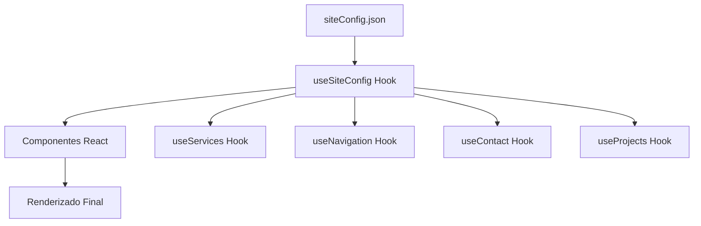

# 📚 MaderexTK - Documentación Completa del Proyecto

## 🏢 **Información del Proyecto**

**Nombre:** MaderexTK - Sitio Web Corporativo  
**Tipo:** Aplicación Web React  
**Estado:** Completamente Modularizado (100%)  
**Versión:** 1.0.0  
**Fecha:** Enero 2025  

---

## 📋 **Índice de Contenidos**

1. [Descripción General](#-descripción-general)
2. [Tecnologías Utilizadas](#-tecnologías-utilizadas)
3. [Estructura del Proyecto](#-estructura-del-proyecto)
4. [Instalación y Configuración](#-instalación-y-configuración)
5. [Arquitectura del Sistema](#-arquitectura-del-sistema)
6. [Configuración JSON](#-configuración-json)
7. [Componentes Principales](#-componentes-principales)
8. [Páginas del Sitio](#-páginas-del-sitio)
9. [Hooks Personalizados](#-hooks-personalizados)
10. [Guía de Uso](#-guía-de-uso)
11. [Deployment](#-deployment)
12. [Mantenimiento](#-mantenimiento)
13. [Solución de Problemas](#-solución-de-problemas)
14. [Futuras Mejoras](#-futuras-mejoras)

---

## 🎯 **Descripción General**

MaderexTK es un sitio web corporativo completamente modularizado para una empresa del sector maderero. El proyecto implementa una arquitectura avanzada donde **todo el contenido se gestiona desde un archivo JSON centralizado**, permitiendo actualizaciones sin modificar código.

### **Características Principales:**
- ✅ **Contenido 100% dinámico** desde configuración JSON
- ✅ **Arquitectura modular** con componentes reutilizables
- ✅ **Hooks personalizados** para lógica específica
- ✅ **Responsive design** optimizado para todos los dispositivos
- ✅ **SEO optimizado** con meta tags dinámicos
- ✅ **Performance optimizada** con lazy loading
- ✅ **Formulario de contacto** con validación
- ✅ **Integración con WhatsApp** para comunicación directa

---

## 🛠️ **Tecnologías Utilizadas**

### **Frontend:**
- **React 18** - Biblioteca principal
- **React Router DOM** - Navegación entre páginas
- **React Icons** - Iconografía (Gi, Fa, Bs, etc.)
- **CSS3** - Estilos y animaciones
- **HTML5** - Estructura semántica

### **Herramientas de Desarrollo:**
- **Vite** - Build tool y dev server
- **ESLint** - Linting de código
- **Prettier** - Formateo de código
- **Git** - Control de versiones

### **Librerías Adicionales:**
- **Swiper.js** - Carousels y sliders
- **EmailJS** - Envío de emails desde frontend
- **React Hook Form** - Manejo de formularios

---

## 📁 **Estructura del Proyecto**

```
redesing-maderex/
├── public/
│   ├── images/                 # Imágenes del sitio
│   ├── videos/                 # Videos de fondo
│   ├── favicon.ico
│   └── index.html
├── src/
│   ├── components/             # Componentes React
│   │   ├── common/
│   │   │   └── DynamicIcon.jsx
│   │   ├── Header.jsx
│   │   ├── Main.jsx
│   │   ├── About.jsx
│   │   ├── Projects.jsx
│   │   ├── Footer.jsx
│   │   └── Formulario.jsx
│   ├── pages/                  # Páginas del sitio
│   │   ├── Aboutus.jsx
│   │   ├── Exports.jsx
│   │   ├── Aserrio.jsx
│   │   └── Buenvivir.jsx
│   ├── hooks/                  # Hooks personalizados
│   │   └── useSiteConfig.js
│   ├── config/                 # Configuración
│   │   └── siteConfig.json
│   ├── styles/                 # Archivos CSS
│   │   ├── App.css
│   │   ├── Header.css
│   │   ├── Main.css
│   │   └── [otros].css
│   ├── App.jsx                 # Componente principal
│   └── main.jsx               # Punto de entrada
├── docs/                      # Documentación
│   ├── README.md
│   ├── DOCUMENTACION_JSON.md
│   └── MODULARIZACION_COMPLETA_100.md
├── package.json               # Dependencias npm
├── vite.config.js            # Configuración Vite
└── .gitignore               # Archivos ignorados por Git
```

---

## ⚙️ **Instalación y Configuración**

### **Requisitos Previos:**
- Node.js (versión 16 o superior)
- npm o yarn
- Git

### **Pasos de Instalación:**

1. **Clonar el repositorio:**
```bash
git clone https://github.com/tu-usuario/redesing-maderex.git
cd redesing-maderex
```

2. **Instalar dependencias:**
```bash
npm install
```

3. **Configurar variables de entorno:**
```bash
# Crear archivo .env en la raíz del proyecto
VITE_EMAILJS_SERVICE_ID=tu_service_id
VITE_EMAILJS_TEMPLATE_ID=tu_template_id
VITE_EMAILJS_PUBLIC_KEY=tu_public_key
```

4. **Ejecutar en modo desarrollo:**
```bash
npm run dev
```

5. **Abrir en el navegador:**
```
http://localhost:5173
```

### **Scripts Disponibles:**
```json
{
  "dev": "vite",                    // Servidor de desarrollo
  "build": "vite build",            // Build para producción
  "preview": "vite preview",        // Preview del build
  "lint": "eslint src --ext js,jsx" // Linting de código
}
```

---

## 🏗️ **Arquitectura del Sistema**

### **Patrón de Arquitectura:**
El proyecto implementa una **arquitectura basada en configuración** con los siguientes principios:

1. **Separación de Responsabilidades**
   - Contenido → `siteConfig.json`
   - Lógica → Hooks personalizados
   - Presentación → Componentes React
   - Estilos → Archivos CSS modulares

2. **Single Source of Truth**
   - Todo el contenido proviene de `siteConfig.json`
   - Evita duplicación y inconsistencias
   - Facilita mantenimiento y actualizaciones

3. **Componentes Reutilizables**
   - `DynamicIcon` para iconos dinámicos
   - Hooks personalizados para lógica compartida
   - Componentes modulares y configurables

### **Flujo de Datos:**



---

## 📄 **Configuración JSON**

El archivo `src/config/siteConfig.json` es el corazón del sistema. Contiene toda la configuración del sitio:

### **Estructura Principal:**

```json
{
  "siteInfo": {
    "name": "Maderex TK",
    "description": "Empresa líder en productos madereros...",
    "yearsOfExperience": 25,
    "sustainabilityCommitment": "100% sostenible"
  },
  "logos": {
    "main": "/images/logo.png",
    "withText": "/images/logo-text.png"
  },
  "contact": {
    "phone": "+506 2222 2222",
    "whatsapp": "+506 8888 8888",
    "email": "info@maderextk.com",
    "address": "San José, Costa Rica"
  },
  "socialMedia": {
    "facebook": "https://facebook.com/maderextk",
    "instagram": "https://instagram.com/maderextk",
    "tiktok": "https://tiktok.com/@maderextk",
    "twitter": "https://twitter.com/maderextk"
  },
  "navigation": { /* ... */ },
  "hero": { /* ... */ },
  "services": [ /* ... */ ],
  "about": { /* ... */ },
  "projects": [ /* ... */ ],
  "contactForm": { /* ... */ },
  "pages": { /* ... */ }
}
```

### **Secciones Detalladas:**

#### **🔧 siteInfo**
Información general de la empresa:
```json
{
  "name": "Nombre de la empresa",
  "description": "Descripción general",
  "yearsOfExperience": 25,
  "sustainabilityCommitment": "Compromiso ambiental"
}
```

#### **🎨 logos**
Rutas de los logos:
```json
{
  "main": "/images/logo.png",
  "withText": "/images/logo-with-text.png"
}
```

#### **📞 contact**
Información de contacto:
```json
{
  "phone": "+506 2222 2222",
  "secondaryPhone": "+506 3333 3333",
  "whatsapp": "+506 8888 8888",
  "secondaryWhatsapp": "+506 9999 9999",
  "email": "info@empresa.com",
  "address": "Dirección completa"
}
```

#### **🌐 socialMedia**
Redes sociales:
```json
{
  "facebook": "https://facebook.com/empresa",
  "instagram": "https://instagram.com/empresa",
  "tiktok": "https://tiktok.com/@empresa",
  "twitter": "https://twitter.com/empresa"
}
```

#### **🧭 navigation**
Configuración de navegación:
```json
{
  "main": [
    {
      "name": "Inicio",
      "path": "#home",
      "type": "scroll"
    },
    {
      "name": "Servicios",
      "path": "#services",
      "type": "scroll"
    }
  ],
  "footer": [ /* similar structure */ ]
}
```

**Tipos de navegación:**
- `"scroll"` - Scroll suave en la misma página
- `"route"` - Navegación con React Router
- `"external"` - Enlace externo (nueva pestaña)

#### **🦸 hero**
Sección principal:
```json
{
  "backgroundVideo": "/videos/hero-bg.mp4",
  "title": "TÍTULO PRINCIPAL",
  "subtitle": "Subtítulo",
  "description": "Descripción detallada...",
  "ctaButton": {
    "text": "Contáctanos",
    "action": "scroll",
    "target": "#contact"
  }
}
```

#### **🔧 services**
Servicios de la empresa:
```json
[
  {
    "id": "store",
    "title": "Store",
    "description": "Descripción del servicio",
    "background": "/images/service-bg.jpg",
    "icon": "FaStore",
    "route": "#services",
    "type": "scroll",
    "button": {
      "text": "Ver más",
      "whatsappMessage": "Mensaje personalizado"
    }
  }
]
```

#### **📖 about**
Sección Acerca de:
```json
{
  "home": {
    "title": "Título para home",
    "content": "Contenido para la página principal",
    "button": {
      "text": "Conoce más",
      "route": "/about"
    }
  },
  "page": {
    "hero": { /* configuración del hero */ },
    "mission": { /* misión */ },
    "vision": { /* visión */ },
    "partners": [ /* socios */ ],
    "stats": [ /* estadísticas */ ]
  }
}
```

#### **🏗️ projects**
Proyectos destacados:
```json
[
  {
    "name": "Nombre del proyecto",
    "description": "Descripción detallada",
    "image": "/images/project1.jpg"
  }
]
```

#### **📝 contactForm**
Configuración del formulario:
```json
{
  "title": "Contáctanos",
  "subtitle": "Envíanos un mensaje",
  "fields": [
    {
      "name": "name",
      "type": "text",
      "placeholder": "Tu nombre",
      "required": true
    }
  ],
  "submitButton": "Enviar mensaje",
  "successMessage": "¡Mensaje enviado exitosamente!"
}
```

#### **📄 pages**
Configuración de páginas específicas:

**Exports:**
```json
{
  "exports": {
    "hero": { /* configuración hero */ },
    "sections": [
      {
        "title": "Título sección",
        "content": "Contenido...",
        "image": "/images/section.jpg",
        "layout": "text-left"
      }
    ],
    "finalMessage": { /* mensaje final */ }
  }
}
```

**Sawmill (Aserrío):**
```json
{
  "sawmill": {
    "hero": { /* hero */ },
    "process": { /* proceso */ },
    "services": [ /* servicios */ ],
    "sections": [ /* secciones dinámicas */ ],
    "cta": { /* call to action final */ }
  }
}
```

**Buenvivir:**
```json
{
  "buenvivir": {
    "hero": { /* hero */ },
    "quality": { /* calidad */ },
    "features": [ /* características */ ],
    "customization": { /* personalización */ }
  }
}
```

---

## 🧩 **Componentes Principales**

### **1. Header.jsx**
**Funcionalidad:** Navegación principal y información de contacto.

**Props del JSON:**
- `logos.main` - Logo principal
- `navigation.main` - Menú de navegación
- `contact.phone` - Teléfono
- `socialMedia.*` - Redes sociales

**Características:**
- Navegación responsive con menú hamburguesa
- Links dinámicos con tipos de navegación
- Información de contacto prominente
- Integración con redes sociales

### **2. Main.jsx**
**Funcionalidad:** Sección hero y carousel de servicios.

**Props del JSON:**
- `hero.*` - Configuración completa del hero
- `services` - Array de servicios
- `siteInfo.*` - Información general

**Características:**
- Video de fondo dinámico
- Carousel interactivo de servicios
- Botones CTA configurables
- Iconos dinámicos para servicios

### **3. About.jsx**
**Funcionalidad:** Sección "Acerca de" en el home.

**Props del JSON:**
- `about.home.*` - Contenido específico para home
- `siteInfo.yearsOfExperience` - Años de experiencia

**Características:**
- Contenido completamente editable
- Botón de navegación configurable
- Layout responsive

### **4. Projects.jsx**
**Funcionalidad:** Showcase de proyectos destacados.

**Props del JSON:**
- `projects` - Array de proyectos

**Características:**
- Grid responsive de proyectos
- Imágenes optimizadas
- Descripciones dinámicas

### **5. Footer.jsx**
**Funcionalidad:** Pie de página con información corporativa.

**Props del JSON:**
- `contact.*` - Información de contacto
- `navigation.footer` - Enlaces del footer
- `socialMedia.*` - Redes sociales
- `siteInfo.*` - Información general

**Características:**
- Información de contacto completa
- Enlaces de navegación
- Redes sociales
- Copyright dinámico

### **6. Formulario.jsx**
**Funcionalidad:** Formulario de contacto con validación.

**Props del JSON:**
- `contactForm.*` - Configuración completa

**Características:**
- Campos dinámicos desde JSON
- Validación automática
- Integración con EmailJS
- Mensajes de éxito/error configurables

---

## 📄 **Páginas del Sitio**

### **1. Aboutus.jsx**
**Ruta:** `/about`
**Funcionalidad:** Página completa "Acerca de nosotros"

**Secciones:**
- Hero personalizado
- Misión y visión
- Partners/socios
- Estadísticas de la empresa
- Call to action final

### **2. Exports.jsx**
**Ruta:** `/exports`
**Funcionalidad:** Información sobre servicios de exportación

**Secciones:**
- Hero específico
- 3 secciones con layout alternado
- Mensaje final motivacional

### **3. Aserrio.jsx**
**Ruta:** `/sawmill`
**Funcionalidad:** Servicios de aserrío y procesamiento

**Secciones:**
- Hero con información específica
- Proceso de trabajo
- Grid de servicios
- 3 secciones dinámicas
- Call to action final

### **4. Buenvivir.jsx**
**Ruta:** `/buenvivir`
**Funcionalidad:** Línea de productos para construcción

**Secciones:**
- Hero dedicado
- Sección de calidad
- Grid de características
- Personalización de productos
- Compromiso empresarial

---

## 🎣 **Hooks Personalizados**

### **1. useSiteConfig()**
**Archivo:** `src/hooks/useSiteConfig.js`
**Funcionalidad:** Hook principal que carga toda la configuración.

```javascript
const config = useSiteConfig();
// Acceso a toda la configuración
const { siteInfo, contact, services, etc } = config;
```

### **2. useServices()**
**Funcionalidad:** Manejo específico de servicios.

```javascript
const services = useServices();
// Retorna array de servicios con métodos útiles
```

### **3. useNavigation()**
**Funcionalidad:** Control de navegación y scroll.

```javascript
const { navigate, scrollTo } = useNavigation();
// navigate('/route') o scrollTo('#section')
```

### **4. useContact()**
**Funcionalidad:** Información de contacto centralizada.

```javascript
const contact = useContact();
// { phone, email, whatsapp, address }
```

### **5. useProjects()**
**Funcionalidad:** Administración de proyectos.

```javascript
const projects = useProjects();
// Array de proyectos con información completa
```

---

## 📝 **Guía de Uso**

### **Para Editores de Contenido:**

#### **Cambiar Textos Generales:**
```json
// En siteConfig.json
{
  "siteInfo": {
    "name": "Nuevo nombre de empresa",
    "description": "Nueva descripción..."
  }
}
```

#### **Actualizar Información de Contacto:**
```json
{
  "contact": {
    "phone": "+506 nuevo-telefono",
    "email": "nuevo@email.com"
  }
}
```

#### **Agregar/Modificar Servicios:**
```json
{
  "services": [
    {
      "id": "nuevo-servicio",
      "title": "Título del Servicio",
      "description": "Descripción detallada",
      "background": "/images/nueva-imagen.jpg",
      "icon": "FaNewIcon",
      "route": "/nueva-ruta",
      "type": "route"
    }
  ]
}
```

#### **Actualizar Proyectos:**
```json
{
  "projects": [
    {
      "name": "Proyecto Actualizado",
      "description": "Nueva descripción",
      "image": "/images/proyecto-nuevo.jpg"
    }
  ]
}
```

#### **Modificar Navegación:**
```json
{
  "navigation": {
    "main": [
      {
        "name": "Nueva Sección",
        "path": "#nueva-seccion",
        "type": "scroll"
      }
    ]
  }
}
```

### **Para Desarrolladores:**

#### **Agregar Nuevos Componentes:**
1. Crear el componente en `/src/components/`
2. Importar `useSiteConfig` o hooks específicos
3. Consumir configuración del JSON
4. Agregar estilos en archivo CSS correspondiente

```javascript
// Ejemplo de nuevo componente
import { useSiteConfig } from '../hooks/useSiteConfig';

function NuevoComponente() {
  const config = useSiteConfig();
  const { nuevaSeccion } = config;

  return (
    <section>
      <h2>{nuevaSeccion.title}</h2>
      <p>{nuevaSeccion.content}</p>
    </section>
  );
}
```

#### **Crear Nuevas Páginas:**
1. Crear archivo en `/src/pages/`
2. Configurar ruta en `App.jsx`
3. Agregar configuración en JSON bajo `pages`
4. Implementar navegación en menú

```javascript
// En App.jsx
import NuevaPagina from './pages/NuevaPagina';

// Agregar ruta
<Route path="/nueva" element={<NuevaPagina />} />
```

#### **Extender Hooks:**
```javascript
// Agregar nueva funcionalidad a useSiteConfig
export function useNuevaFuncionalidad() {
  const config = useSiteConfig();
  
  // Lógica específica
  return {
    // datos procesados
  };
}
```

---

## 🚀 **Deployment**

### **Build para Producción:**
```bash
npm run build
```

### **Verificar Build:**
```bash
npm run preview
```

### **Deployment en Netlify:**
1. Conectar repositorio GitHub
2. Configurar build command: `npm run build`
3. Configurar publish directory: `dist`
4. Configurar variables de entorno

### **Deployment en Vercel:**
1. Importar proyecto desde GitHub
2. Configuración automática detectada
3. Configurar variables de entorno
4. Deploy automático

### **Variables de Entorno Requeridas:**
```bash
VITE_EMAILJS_SERVICE_ID=your_service_id
VITE_EMAILJS_TEMPLATE_ID=your_template_id  
VITE_EMAILJS_PUBLIC_KEY=your_public_key
```

### **Archivos de Producción:**
```
dist/
├── assets/
│   ├── index-[hash].js
│   ├── index-[hash].css
│   └── [otros assets]
├── images/
├── videos/
└── index.html
```

---

## 🔧 **Mantenimiento**

### **Actualizaciones de Contenido:**
1. Editar `src/config/siteConfig.json`
2. Verificar cambios en desarrollo
3. Commit y push al repositorio
4. Deployment automático (si configurado)

### **Actualizaciones de Dependencias:**
```bash
# Verificar dependencias desactualizadas
npm outdated

# Actualizar dependencias
npm update

# Verificar vulnerabilidades
npm audit
npm audit fix
```

### **Optimización de Imágenes:**
- Usar formatos WebP cuando sea posible
- Comprimir imágenes antes de subir
- Mantener imágenes en `/public/images/`
- Usar tamaños apropiados para cada contexto

### **Performance Monitoring:**
- Usar Chrome DevTools para auditorías
- Verificar Core Web Vitals
- Optimizar imágenes y videos
- Implementar lazy loading donde sea necesario

### **SEO Maintenance:**
- Actualizar meta tags en `index.html`
- Verificar estructuras de datos
- Mantener sitemap actualizado
- Monitorear velocidad de carga

---

## 🐛 **Solución de Problemas**

### **Problemas Comunes:**

#### **Error: Cannot read property of undefined**
**Causa:** Hook `useSiteConfig` no encuentra configuración  
**Solución:**
1. Verificar que `siteConfig.json` existe
2. Verificar formato JSON válido
3. Verificar importación correcta del hook

#### **Iconos no se muestran**
**Causa:** Nombre de icono incorrecto en JSON  
**Solución:**
1. Verificar nombres de iconos en react-icons
2. Asegurar importación en `DynamicIcon.jsx`
3. Usar nombres exactos (case-sensitive)

#### **Formulario no envía emails**
**Causa:** Configuración EmailJS incorrecta  
**Solución:**
1. Verificar variables de entorno
2. Verificar configuración en dashboard EmailJS
3. Verificar template ID correcto

#### **Navegación no funciona**
**Causa:** Configuración de rutas o scroll incorrecto  
**Solución:**
1. Verificar tipos de navegación en JSON
2. Verificar rutas en `App.jsx`
3. Verificar elementos target para scroll

#### **Build falla**
**Causa:** Errores de sintaxis o dependencias  
**Solución:**
```bash
# Verificar errores
npm run lint

# Limpiar node_modules
rm -rf node_modules
npm install

# Verificar dependencias
npm audit fix
```

### **Debugging Tips:**
```javascript
// Agregar console.log para verificar datos
const config = useSiteConfig();
console.log('Config cargada:', config);

// Verificar JSON en navegador
fetch('/src/config/siteConfig.json')
  .then(r => r.json())
  .then(console.log);
```

---

## 🔮 **Futuras Mejoras**

### **Funcionalidades Planificadas:**

#### **Multiidioma (i18n)**
- Estructura JSON por idioma
- Hook `useLanguage()`
- Selector de idioma en header
- Persistencia de selección

#### **CMS Integration**
- API para gestión de contenido
- Panel de administración
- Actualización en tiempo real
- Gestión de medios

#### **Performance Optimizations**
- Lazy loading de componentes
- Image optimization automática
- Service Workers
- Caching estratégico

#### **Analytics & SEO**
- Google Analytics 4
- Meta tags dinámicos
- Schema.org markup
- Sitemap automático

#### **Advanced Features**
- Sistema de blog
- Galería de productos
- Calculadora de presupuestos
- Chat en vivo

#### **Mobile Enhancements**
- PWA capabilities
- App-like navigation
- Offline support
- Push notifications

### **Arquitectura Future-Ready:**

#### **API Integration Ready**
```javascript
// Estructura preparada para APIs
export function useApiConfig() {
  const [config, setConfig] = useState(null);
  
  useEffect(() => {
    // Fetch from API instead of JSON
    fetchConfigFromAPI()
      .then(setConfig);
  }, []);
  
  return config;
}
```

#### **Component Library**
```javascript
// Preparado para extraer como librería
export {
  DynamicIcon,
  useSiteConfig,
  useServices,
  // ... otros componentes reutilizables
}
```

#### **Theme System**
```javascript
// Sistema de temas preparado
export function useTheme() {
  return {
    primary: config.theme.primary,
    secondary: config.theme.secondary,
    // ...
  };
}
```

---

## 📞 **Soporte y Contacto**

### **Documentación Adicional:**
- `README.md` - Información básica del proyecto
- `DOCUMENTACION_JSON.md` - Detalles específicos del JSON
- `MODULARIZACION_COMPLETA_100.md` - Estado de modularización

### **Recursos de Desarrollo:**
- [React Documentation](https://react.dev/)
- [React Router](https://reactrouter.com/)
- [React Icons](https://react-icons.github.io/react-icons/)
- [Vite Guide](https://vitejs.dev/guide/)

### **Para Soporte Técnico:**
1. Revisar esta documentación
2. Verificar issues en el repositorio
3. Consultar logs de consola
4. Contactar al equipo de desarrollo

---

## 📋 **Checklist de Deployment**

### **Pre-Deployment:**
- [ ] Verificar que todos los tests pasan
- [ ] Revisar console.log y remover debug code
- [ ] Optimizar imágenes y assets
- [ ] Verificar variables de entorno
- [ ] Testear formulario de contacto
- [ ] Verificar links y navegación
- [ ] Revisar responsive design
- [ ] Verificar performance con Lighthouse

### **Deployment:**
- [ ] Build exitoso sin errores
- [ ] Variables de entorno configuradas
- [ ] DNS configurado correctamente
- [ ] SSL/TLS habilitado
- [ ] Redirects configurados
- [ ] Analytics configurado

### **Post-Deployment:**
- [ ] Verificar sitio en producción
- [ ] Testear formulario en producción
- [ ] Verificar todas las páginas
- [ ] Testear en dispositivos móviles
- [ ] Verificar velocidad de carga
- [ ] Configurar monitoring

---

## 🏆 **Conclusión**

MaderexTK representa un ejemplo de **arquitectura moderna y mantenible** para sitios web corporativos. La **modularización completa al 100%** permite:

- ✅ **Actualizaciones sin programación** 
- ✅ **Mantenimiento simplificado**
- ✅ **Escalabilidad garantizada**
- ✅ **Performance optimizada**
- ✅ **Base sólida para el futuro**

El proyecto está **completamente documentado** y **listo para producción**, con una base técnica que permite crecimiento y adaptación a futuras necesidades.

---

**📅 Última actualización:** Enero 2025  
**🔢 Versión:** 1.0.0  
**👥 Estado:** Producción Ready  
**🎯 Modularización:** 100% Completa
